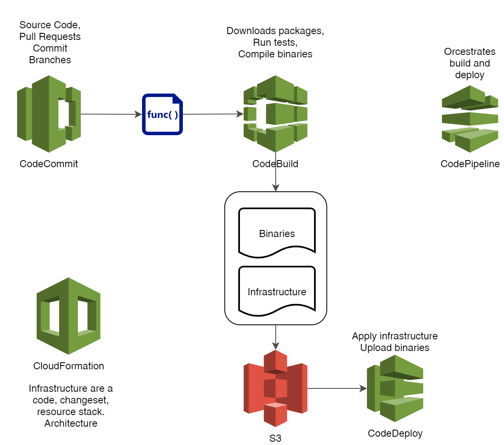
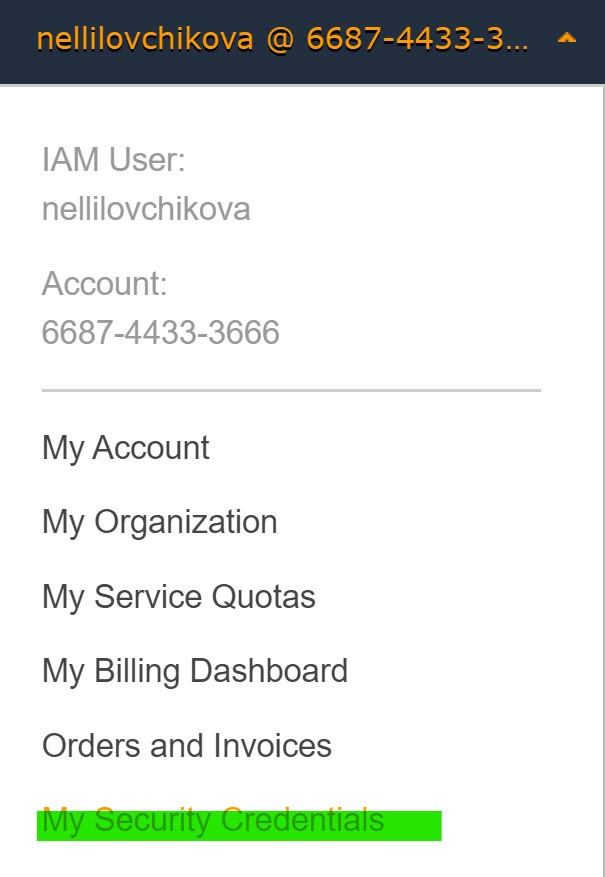
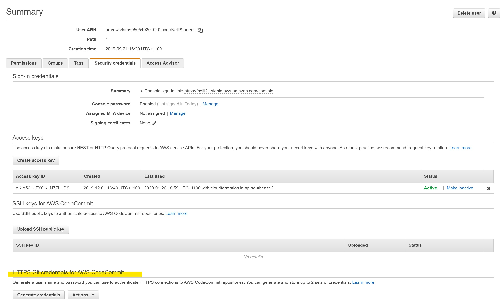

## Repository
### Credentials
In order to obtain credentials for git go to  Your name on top nav menu -> My Security Credentials -> AWS CodeCommit credentials tab -> HTTPS Git credentials for AWS CodeCommit



### Create repository
You can create repository using CLI

```cmd 
aws codecommit create-repository --repository-name nelli-playing-with-ci
```
The output will give you clone link

or

Console -> Developer Tools -> CodeCommit -> Source -> Repositories -> Create -> Repository

## Code
### Create lambda
create index.js and paste code 
```javascript
exports.handler = async (event) => {
    const response = {
        statusCode: 200,
        body: JSON.stringify('Hello from Lambda2!'),
    };
    return response;
};
```

### Create CloudFormation template
create buildSpec.yaml

```yaml
Description: Dev Theory Workshop
Resources:
  mylambda:
      Type: AWS::Lambda::Function
      Properties: 
        Handler: index.handler
        Runtime: nodejs12.x
        Code: ./my-lambda/
        Role: arn:aws:iam::668744333666:role/LambdaBasic
Outputs:
  myLambdaArn:
    Value: !Ref mylambda

```

### Artefact storage
Create s3 bucket for artefacts 

```aws s3 mb s3://lambda-deployment-artifacts-123456789012```

### Build specification
create buildspec.yaml (should be in the root)
```yaml
version: 0.2
phases:
  install:
    runtime-versions:
        nodejs: 10
  build:
    commands:
      - export BUCKET=nelli-lambda-deployment-artifacts-123456789012
      - aws cloudformation package --template-file template.yml --s3-bucket $BUCKET --output-template-file outputtemplate.yml
artifacts:
  type: zip
  files:
    - template.yml
    - outputtemplate.yml

```

> Push your files into repository

## Build Pipeline
Create Pipeline
- __Source Provider__ : AWS CodeCommit
- Your repository name
- Branch - master

- __Build Provider__: AWS CodeBuild
- Create project - will open new window
- __Operating system__ : Ubuntu
- __Runtime__:Standard
- __Image__: aws/codebuild/standard:2.0


### Deploy step
- __Deploy provider__: AWS Cloud Formation
- __Action mode__: Create or update a stack
- Give your stack a name
- __Artifact name__: BuildArtifact
- __File Name__: outputtemplate.yml
- __Role name__: arn:aws:iam::668744333666:role/cfn-workshop-lambda-pipeline